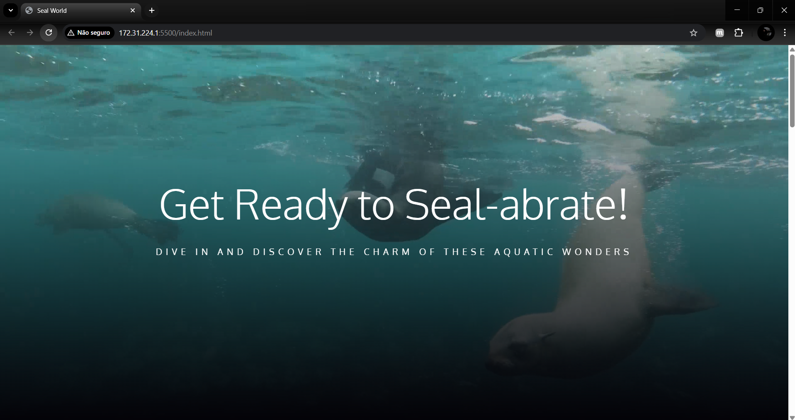
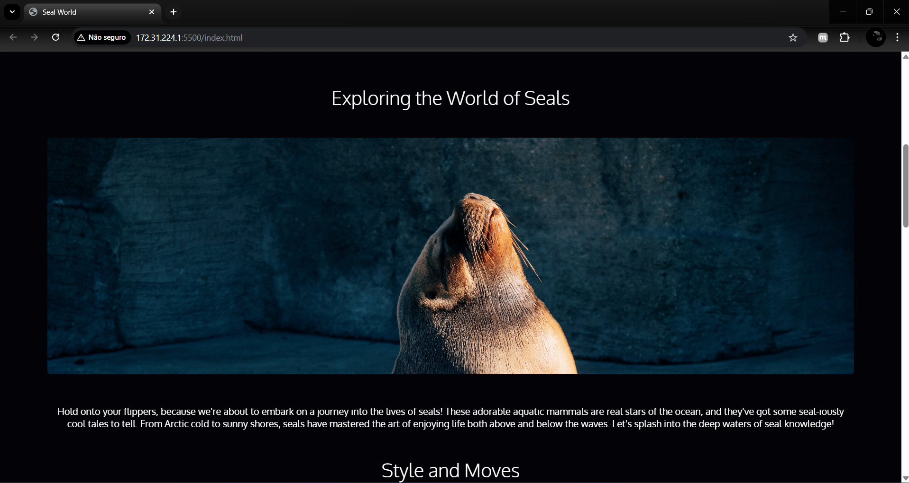
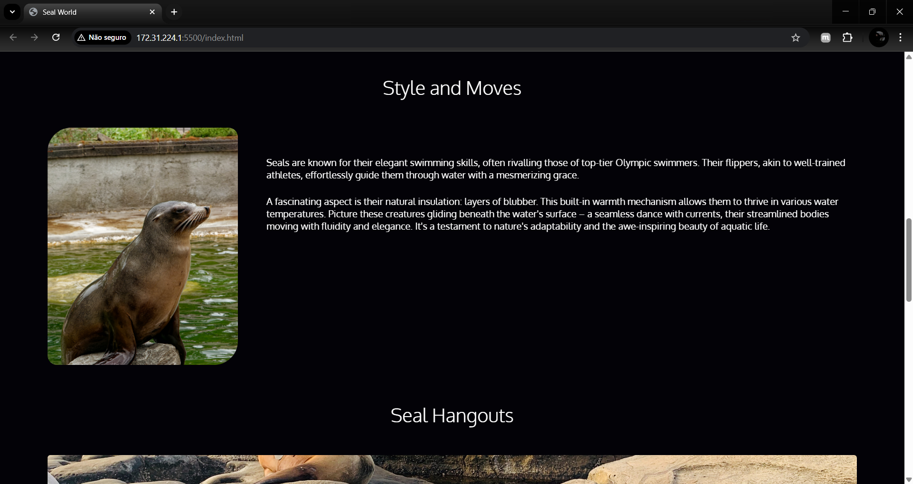
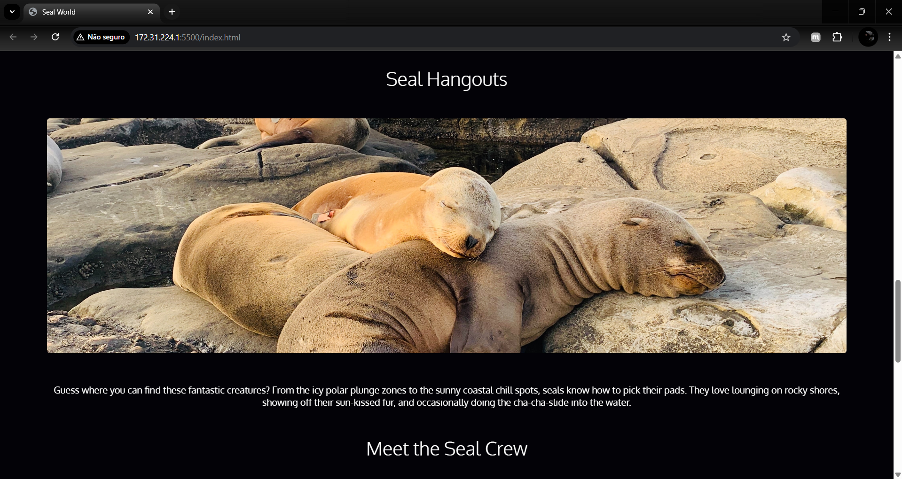
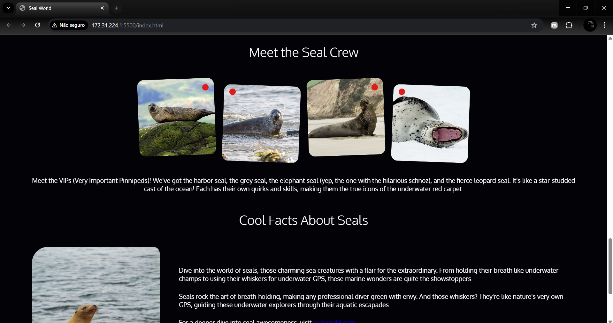
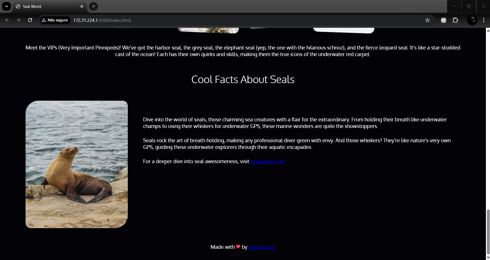

# Seal World

"Seal World" é um site simples em HTML e CSS dedicado ao mundo das focas. A página apresenta informações sobre o comportamento das focas, como suas habilidades de natação, locais favoritos e curiosidades interessantes sobre elas.

## Notas sobre o Projeto

- Este projeto **não é responsivo** para dispositivos móveis no momento.
- Não há media queries implementadas, o que pode afetar a experiência do usuário em telas menores.
- Implementações futuras podem incluir ajustes para garantir que o site seja acessível e bem apresentado em todos os dispositivos.

## Como rodar o projeto

1. Clone o repositório:
```bash
git clone git@github.com:hello-arth/seal-world.git
```
2. Navegue até a pasta do projeto:
   cd seal-world

3. Abra o arquivo `index.html` em seu navegador para visualizar a página.

## Stack utilizada

- HTML
- CSS

## 📌 Veja o projeto online

O projeto está hospedado e pode ser acessado no seguinte link:

🔗 [Seal World](https://seal-world-alpha.vercel.app/)

## 📸 Capturas de Tela









## Licença

Este projeto está sob a licença MIT. Consulte o arquivo `LICENSE` para mais detalhes.

